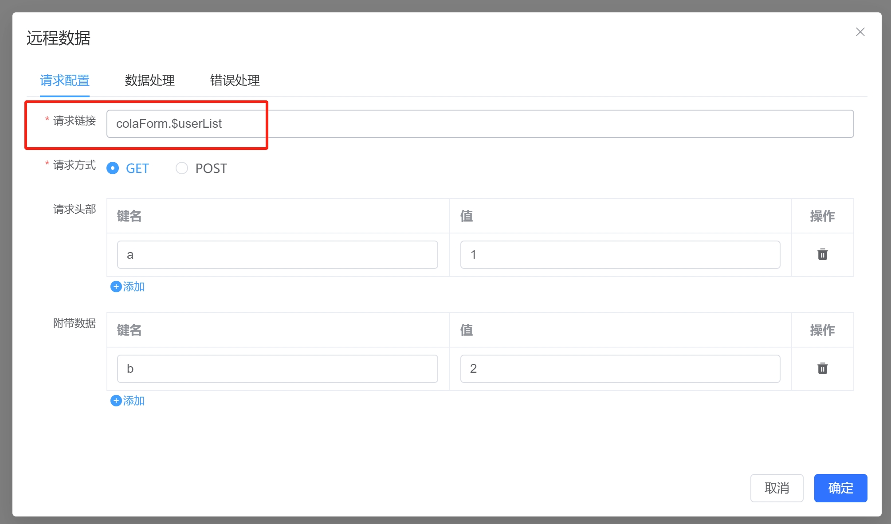

# 模式切换

通过type=?切换，只要前置字母是(d|D)就切换到设计器模式，否则为表单模式

> sf.html: 表单模式
>
> sf.html?type=d: 设计器模式


# 接口

使用colaForm实例调用

```js
class ColaForm {
  /**
   * 设置主题
   * 支持: [Form]
   * @param {string} theme：'dark' | 'light'
   */
  setTheme(theme);

  /**
   * 设置语言
   * 支持: [Designer]
   * @param {string} lang：'zhCN' | 'enUS'
   */
  setLang(lang);

  /**
   * 设置只读
   * 支持: [Form]
   * @param {boolean} readonly
   */
  setReadonly = (readonly);

  /**
   * 设置预览（预览模式下会隐藏按钮）
   * 支持: [Form]
   * @param {boolean} preview
   */
  setPreview(preview);

  /**
   * 加载数据
   * 支持: [Designer, Form]
   * @param {string} schema: 表单纲要
   * @param {string} formData: 表单数据（可夹带私数据），Designer模式下该参数无效
   */
  load(schema, formData);

  /**
   * 提交，通过[colaForm.save]消息返回数据
   * 支持: [Designer, Form]
   */
  submit();

  /**
   * 重置清空(Form模式只会清空表单数据), 通过[colaForm.reset]消息返回清空前的数据
   * 支持: [Designer, Form]
   */
  reset();

  /**
   * 设置表单项数据（在老数据上合并新数据）
   * 支持: [Form]
   * @param {[field]: value} data: 表单项数据集合，可只传入部分数据，可夹带私数据
   */
  setFieldsValue = (data) => this.#post('setFieldsValue', data);
}
```


# 事件

* colaForm.save

  用户使用提交按钮或外部调用colaForm.submit()触发，`Designer返回schema, Form返回formData`(下同)

* colaForm.reset

  用户使用重置按钮或外部调用colaForm.reset()触发，返回清空前的数据

* colaForm.exit

  用户点击页面中的退出按钮后触发，仅对Designer有效，返回当前schema

* colaForm.change

  表单内容发生改变时触发，返回`{id, formData}`

* colaForm.upload

  用户点击上传按钮触发，返回：
  
  ```javascript
  {
    id: 'field.id',
    files: '文件列表，未定义为[]'
    disabled: '是否禁用，未定义为false',
    multiple: '是否支持多选，未定义为false',
    accpet: '可接受的文件类型，未定义为*/*，例:image/*,.pdf',
  }
  ```
  [accept具体使用参考](https://developer.mozilla.org/zh-CN/docs/Web/HTML/Element/input/file#%E5%94%AF%E4%B8%80%E6%96%87%E4%BB%B6%E7%B1%BB%E5%9E%8B%E8%AF%B4%E6%98%8E%E7%AC%A6)

* colaForm.upload.preview

  用户点击文件触发，返回当前field的被点击的文件：`{id, file}`

* colaForm.upload.remove

  用户删除文件触发，返回当前field的被删除的文件：`{id, file}`

* colaForm.$action

  > 注意一定不能和上面重复
  
  
  
  用户在远程数据设置面板中只要符合***`colaForm.$`***为前缀的请求链接，都会别系统拦截，然后按一下方式处理：
  
  1. Flutter中通过AddChannel建立通讯通道，如上图中的colaForm.$userList，如果未监听通道系统不会出错，只是下面所有步骤都会被跳过
  
  2. 当有数据请求时，页面端首先在通道下构建一个会话: `{session: {setData: (data){...}}}`
  
  3. 通过postMessage向通道发送消息`{session, id, type, headers, data}`，例：
  
     ```javascript
     postMessage(
         'colaForm.$userList', 
         '{"session":"Fyh1m3033abaaec","id":"Fnaym3032qsoabc","type":"select","data":{"b":"2"},"headers":{"a":"1"}}')
     ```
  
  4. Flutter端收到该消息后根据传递过来的信息获取数据，然后调用`window[#channel][#session].setData()`回填数据
  
     > 请注意在30秒内完成，为避免资源泄露会话最长存活时间为30秒
  
     ```javascript
     window['colaForm.$userList']['Fyh1m3033abaaec']
         .setData('[{"label":"选项01","value":1},{"label":"选项02","value":2},{"label":"选项03","value":3}]')
     ```
  
     如果有错误，返回{error}结构:
  
     ```javascript
     window['colaForm.$userList']['Fyh1m3033abaaec'].setData('{"error": "..."}')
     ```
  
     

